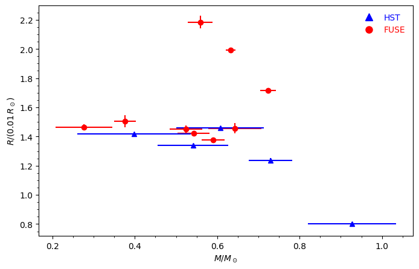

# White Dwarf

This project analyzes the mass-radius relation for white dwarfs using a degenerate, non-relativistic equation of state.

## Contents

1. `README.md`: This file.
2. `astro_const.py`: Module containing physical constants, uses `astropy`.
3. `eos.py`: Code for the equation of state. Includes:
   - `pressure(rho, mue)`: Computes pressure (`P`) as a function of density (`rho`) and mean molecular weight (`mue`).
   - `density(P, mue)`: Computes density (`rho`) as a function of pressure (`P`) and `mue`.
4. `test_eos.py`: Unit test for the equation of state; compares computed values from `eos.py` and `eos_table.txt`.  
5. `eos_table.txt`: Comparison data for the equation of state, used by `test_eos.py`.
6. `structure.py`: Code to integrate stellar structure equations. Includes:
   - `stellar_derivatives(m, z, mue)`: Computes the derivatives of radius and pressure with respect to mass.
   - `central_values(Pc, delta_m, mue)`: Initializes boundary conditions for integration using the central pressure (`Pc`).
   - `lengthscales(m, z, mue)`: Calculates radial and pressure length scales for adaptive step size control.
   - `integrate(Pc, delta_m, eta, xi, mue)`: Integrates the stellar structure equations to calculate mass, radius, and pressure profiles.
   - `pressure_guess(M, mue)`: Provides an initial estimate of the central pressure (`Pc`) for a given mass (`M`).
7. `observations.py`: Module for handling observational data. Includes:
   - `MassRadiusObservations`: A class to read, store, and process observational data from `Joyce.txt`.
   - `make_observation_plot(ax, observations)`: Plots observed mass-radius data next to theoretical predictions.
8. `Joyce.txt`: Table 4, Joyce et al. (2018). Data for `observations.py`.

# Report: White Dwarf Mass-Radius Relation

## 1. Introduction

White dwarfs are stellar remnants supported by electron degeneracy pressure, resulting in a unique mass-radius relationship. This project computes the mass-radius relation for white dwarfs using a non-relativistic degenerate equation of state (EOS) and compares the results with observational data from Joyce et al. (2018).
---

## 2. Testing the Equation of State (EOS)

The EOS relates pressure (\( P \)) and density (\( \rho \)) for a degenerate electron gas. It was tested using the provided `test_eos.py` script, which validates the functions `pressure` and `density` against tabulated values in `eos_table.txt`. All results fell within the specified tolerance (\( < 10^{-12} \)), confirming the correctness of the EOS implementation.

---

## 3. Convergence of Numerical Integration

### 3a. Rationale for Parameters (\( \delta_m, \eta, \xi \))
- **\( \delta_m \):**  
  \( \delta_m \) represents the initial mass step near the core where density and pressure are approximately constant. A small value ensures accurate integration without numerical instability. After testing, \( \delta_m = 10^{-10} M_\odot \) provided stable results.

- **\( \eta \):**  
  \( \eta \) determines the stopping condition for pressure, set as a fraction of the central pressure (\( P_c \)). A value of \( \eta = 10^{-10} \) ensured that integration stopped at the stellar surface without overshooting.

- **\( \xi \):**  
  \( \xi \) scales the integration step size based on radial and pressure length scales. A value of \( \xi = 0.01 \) was optimal, balancing computational efficiency and accuracy.

### 3b. Scaling of Central Pressure and Density
- The central pressure scales as:
  \[
  P_c \propto \frac{GM^2}{R^4}
  \]
  Initial guesses for \( P_c \) were generated using this scaling relation, refined by the shooting method.

- The central density (\( \rho_c \)) scales as:
  \[
  \rho_c \propto \frac{M}{R^3}
  \]
  These scalings provided theoretical consistency and guided parameter tuning during integration.

---

## 4. Results and Visualization

### Mass-Radius Relation
A mass-radius table was computed for white dwarf masses ranging from \( 0.1 M_\odot \) to \( 1.0 M_\odot \). The results are consistent with theoretical predictions, showing a decrease in radius with increasing mass due to stronger gravitational compression.

### Visualization 
The theoretical mass-radius relation was plotted alongside observational data from Joyce et al. (2018). Error bars were included for the observational data, and the plot showed good agreement, particularly for lower-mass white dwarfs. 

---

## 5. Discussion: Realism of the Model 

The model assumes:
1. **Ideal Non-Relativistic Degenerate Gas:**  
   This approximation is accurate for low to intermediate-mass white dwarfs. For higher masses (\( M > 1.0 M_\odot \)), relativistic effects become significant and require a modified EOS.

2. **Composition of Carbon-Oxygen Core:**  
   A core composition of \( \mu_e = 2 \) was assumed, consistent with typical white dwarfs. Variations in composition (e.g., helium or neon) could shift the mass-radius relation.

3. **Spherical Symmetry:**  
   The model assumes perfect spherical symmetry, neglecting effects like rotation or magnetic fields, which could influence the radius.

---

## 6. Conclusion

This project successfully modeled the mass-radius relation of white dwarfs using a computational approach. The results align well with observational data, supporting the theoretical framework of degenerate electron pressure.

---

## References
Joyce, S. R. G., et al. (2018). *Testing the white dwarf mass-radius relation and comparing optical and far-UV spectroscopic results with Gaia DR2, HST, and FUSE*. MNRAS, 479:1612–1626.
